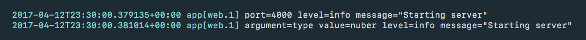

# heroku-logger

A dead simple logger, designed to be perfect for Heroku apps.

---

### Features

- No configuration necessary—with sane defaults based on your `NODE_ENV` and `LOG_LEVEL` environment variables.
- Matches Heroku's own [logfmt](https://brandur.org/logfmt) formatting syntax in production.
- Makes your logging nice and easy to read in development.

---

### Example

Given an API which is what you'd expect...

```js
const logger = require('heroku-logger')

logger.info('Starting server', { port: 4000 })
logger.error('Invalid `type` argument', { argument: 'type', value: 'nuber' })
```

In development, it outputs an easy to read version...


But in production, it omits the junk, since Heroku handles that for you, and simply outputs the data in [`logfmt`]()...



In any add-ons attached to your Heroku log drain, the metadata will be picked up automatically...


That's it!

---

### Why?

There are lots of Node.js logging packages—simple ones that basically just print strings to the console, and complex ones like [Winston](https://github.com/winstonjs/winston) or [Bunyan](https://github.com/trentm/node-bunyan) which give you fine-grained control.

But none that were a one-liner for Heroku apps, with sane defaults.

Heroku already handles all of the logging issues that complex libraries solve—timestamping, process-stamping, log draining, performance, etc. So the complex libraries are just extra configuration for no gains.

But the one thing that no logger handled nicely was matching Heroku's [logfmt](https://brandur.org/logfmt) formatting out of the box. By using logfmt for your application logs, you get a consistent output for everything, so any consumers of the Heroku log drains can automatically parse them, because they're in the same format.

---

### API

```js
const logger = require('heroku-logger')

logger.info('message', { key: 'value' })
```
```
[info] message key=value level=info message=message
```

The package exports the one-liner `logger` singleton as the default, which is already instanciated with sane defaults using the `LOG_LEVEL` and `NODE_ENV` environment variables.

#### new Logger(options)

```js
const Logger = require('heroku-logger').Logger

const logger = new Logger({
  color: Boolean,    // Defaults to `true` only if `NODE=ENV != 'production'`.
  delimiter: String, // Defaults to  `'#'`.
  level: String,     // Defaults to `LOG_LEVEL` if set, or `'info'`.
  prefix: String,    // Defaults to `''`.
  readable: Boolean, // Defaults to `true` only if `NODE=ENV != 'production'`.
})
```

But if you need to create multiple instances, which can be useful for subclassing loggers based on the parts of your system, the `Logger` constructor is also exported, which takes the following options:

- `color` sets whether to log in colors, for easier scanning.
- `level` sets the current log threshold, silencing logs that don't meet it.
- `delimiter` sets the delimiter to use for nested data keys.
- `prefix` sets a string that will be prepend to every message.
- `readable` sets whether to log the `message` separate from the `data`.

#### logger\[level\](message, data)

```js
logger.info('message', { key: 'value' })
logger.error('error!', { code: 400 })
```
```
[info] message key=value level=info message=message
[error] error! code=400 level=error message=error!
```

Log a `message` with `data` to the console at `level`, where level is one of:

- `debug`
- `info`
- `warn`
- `error`

You can also pass an `Error` object as a `message`, in which case the logger will automatically convert it into useful `message` and `data` with a full stack trace.

#### logger.log(level, message, data)

```js
logger.log('info', 'message', { key: 'value' })
```
```
[info] message key=value level=info message=message
```

Log a `message` with `data` to the console at `level`.

#### logger.clone(options)

```js
const other = logger.clone({ prefix: '[package] ' })

other.info('message', { key: 'value' })
```
```
[info] [package] message key=value level=info message=message
```

Create a new `Logger` instance, copying the existing loggers config, but extending it with optional `options`.
